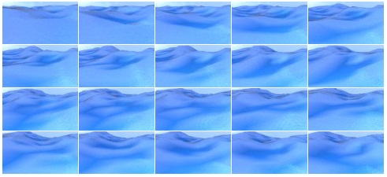

# Wave-simulator

The origin of this work is  shown here: https://github.com/manubatet/Ship-simulator

The code can not be directly executed by python, it is executed by Blender (with Python API ).  This script has been updated by Dajing  to adapt to the Blender 2.83, so instalation of Blender 2.83 is needed.

# Installation
Go to Ubuntu Software and  install  directely Blender 2.83 (the script should be modified if the script is also modified)

# To run the script from terminal
(more info: https://learnsharewithdp.wordpress.com/2018/08/27/how-to-run-a-python-script-in-blender/)

blender filename.blend --python script.py in our case
    
    blender ocean_render.blend --python macro.p
Go to the directory where the script is, and then type in the terminal:
    
    blender ocean_render.blend --python macro.py

A file of the name  'data' is necessary in the directory where the script is.
 
# Files
## parameters.py
Here you have all the parameters that the macro is goingo to import. You can select to iterate between several parameters. Those parameters are only choppiness, wave scale, wind velocity and random seed. Is not very difficult to add more parameters but those are the parameters that are more important to change the simulation. Here: https://docs.blender.org/manual/en/dev/modeling/modifiers/simulate/ocean.html you can find what does each parameter exactly do related to the ocean creation. The parameters about the render are clearly explained in the code.

## macro.py
This is the macro. Theorically you will not need to change anything from here but there are some explanations inside about what the code does and I encourage you to improve the code and add more functions.

# Data

Render 2 frames per second. This is the best option so that the differences between two frames are noticeable and they do not "duplicate" the information.

Generated data

  

# Contact:
Manuel Cortés Batet batetcortesm@gmail.com 

More detailes can be found from this link: https://github.com/manubatet/Ship-simulator  
