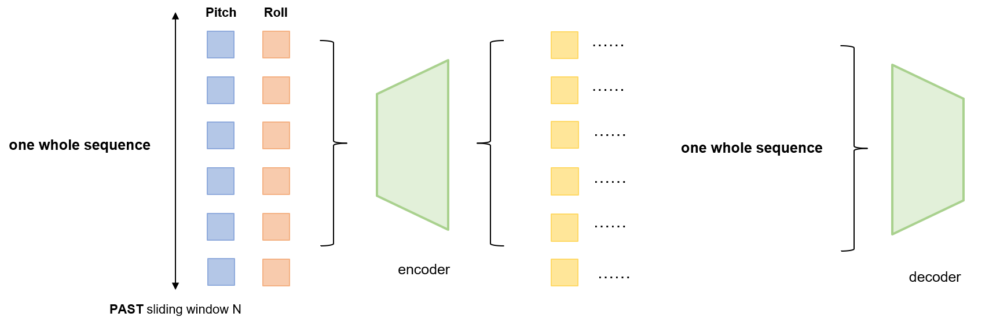
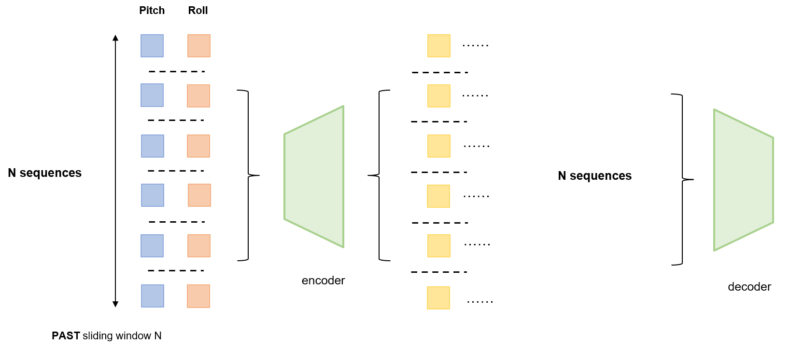
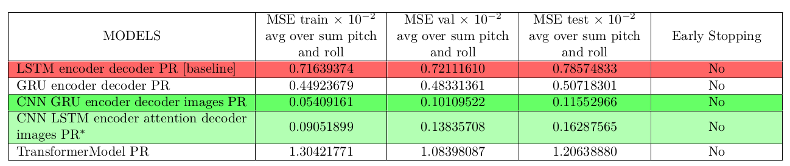
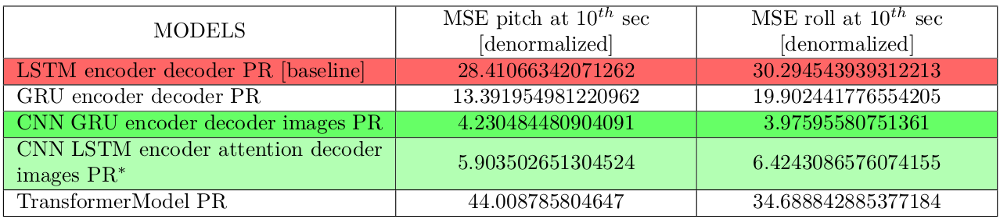
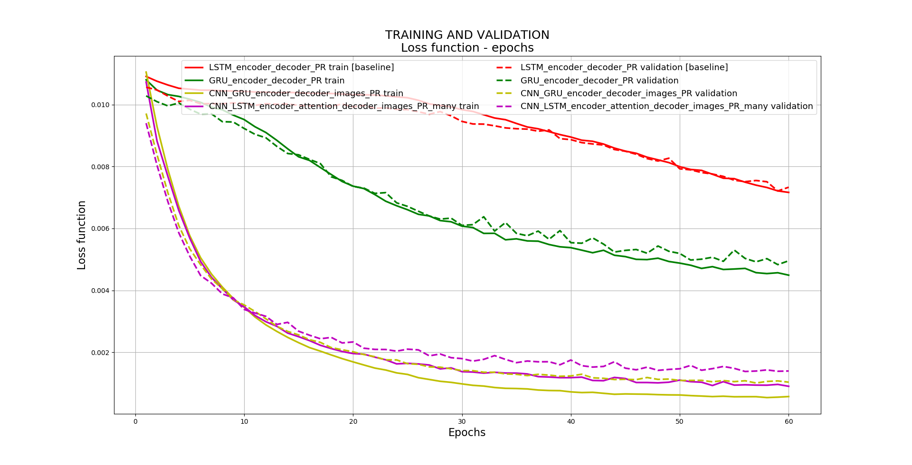
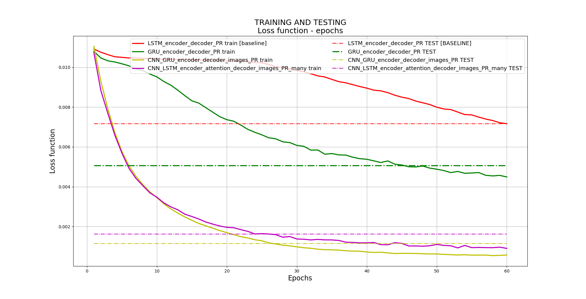
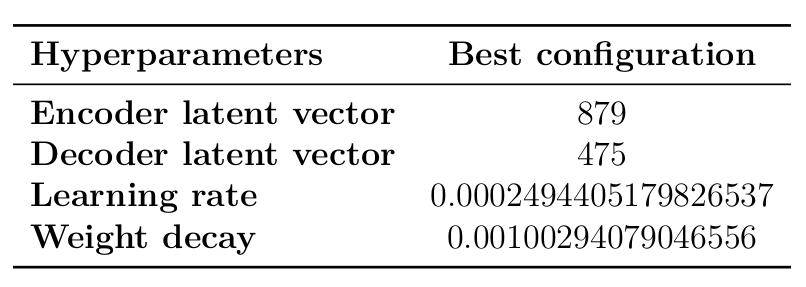
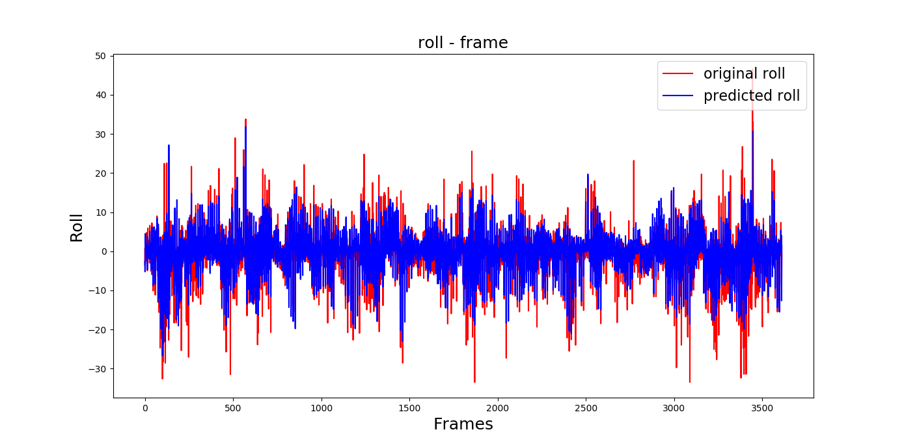

# Model Creation

This work is based on the work of Nazar,  some information can be found here: [[link]](https://github.com/Nazotron1923/Deep_learning_models_for_ship_motion_prediction_from_images)

To solve our pitch and roll prediction problem, 16 mdoels based on the existent wors are created. GRU - Gated recurrent unit networks, Attention mechanism are used. The structure of the extent models are changed from sequence length of size 1 to sequence length of size N in order to make full use of Attention Mechanism. Transformer Model are also considered to be used. An overview of all the models above is given, and the proposed model created in this internship are also analyzed. 

<p align="center">
  
</p>
<p align="justify">

16 models were created:

***Models with sequecne length of size 1***
- GRU encoder deocder PR model
- GRU encoder deocder PR model
- CNN GRU encoder decoder images PR  model
- CNN GRU encoder attention decoder images PR  model
- CNN LSTM encoder GRU attention decoder images PR  model

***Models with sequecne length of size N***
- LSTM encoder decoder PR* model
- GRU encoder decoder PR* model
- LSTM encoder attention decoder PR* model
- LSTM encoder GRU attention decoder PR* model
- GRU encoder attention decoder PR* model
- CNN GRU encoder decoder PR* model
- CNN LSTM encoder attention decoder PR* model
- CNN LSTM encoder GRU attention decoder images PR* model
  
***Models without RNN***
- TransformerModel_PR model

Here the * in the name of models are replaced by many in the code.

<p align="center">
  
</p>
<p align="justify">


LSTM/GRU encoder deocder PR  | CNN LSTM/GRU encoder decoder images PR
:-------------------------:|:-------------------------:
  | 

LSTM/GRU encoder attention deocder PR  |  Attention deocder
:-------------------------:|:-------------------------:
  | 

Attention layer of size 1  | CNN LSTM/GRU encoder attention  decoder images PR
:-------------------------:|:-------------------------:
  | 


LSTM/GRU encoder deocder PR*  | CNN LSTM/GRU encoder decoder images PR*
:-------------------------:|:-------------------------:
  | 

LSTM/GRU deocder*   | CNN LSTM/GRU encoder attention  decoder images PR*
:-------------------------:|:-------------------------:
  | 

LSTM/GRU encoder attention deocder PR*  |  Attention deocder*
:-------------------------:|:-------------------------:
  | 

## Comparison between models with sequence length of size 1 and models with sequence length of size N
The difference between the models with sequence length of size 1 and models with sequence length of size N exists both in the encoder and the decoder. Here N is the number of frames we used as the input of the models. We take LSTM encoder decoder PR as an example in the comparison below.

#### Difference in the part of encoder
In the models of size 1, N frames are concatenated in one sequence as the encoder input, with 2 features (pitch and roll) for each frame. So the encoder input is one sequence with N · 2 words, whose shape is [batchsize, 1, N · 2]. And the size of encoder output is [batchsize, 1, ∗], where ∗ is the latent hidden size (embedding size) we set for the encoder.

And for models of size N, N frames are used respectively as input in N sequences. The encoder input is N sequences, with 2 words (pitch and roll) in each sequence. So the encoder input is of shape [batchsize, N, 2], and the encoder output is of size [batchsize, N, ∗], where ∗ is the latent hidden size (embedding size) we set for the encoder.

encoder of models with sequence length of size 1  |  encoder of models with sequence length of size N
:-------------------------:|:-------------------------:
  | 

The output of a RNN model is the ensemble of the hidden states of all time steps. So in models of size 1, there is only one hidden state can be used, and for new models, there are N hidden states can be used, which caters to the requirements of Attention Mechanism.

#### Difference in the part of decoder
As for the decoder, there are also some differences.

In models of size 1, M frames are predicted in only one step, which means the hidden states are used only once when M frames are predicted. A step in the models of size 1 is replaced with many steps in the models of size 1.

<p align="center">

</p>
<p align="justify">

For models of size N, instead of predicting the result at once, the M frames are predicted frame by frame, the previous hidden states are used and updated when each frame in the future is predicted, which can satisfy the requirements of Attention Mechanism.

<p align="center">

</p>
<p align="justify">

The last encoder input will be the first decoder input of the models to predict one frame in the future. Then the newest decoder output will be the new decoder input of next step. After a cycle of M times, the M decoder output will be concatenated as the final result of prediction. The Attention Mechanism is able to connect the present frame with the hidden states of the previous hidden states. So an attention layer added in the decoder can make better use of the hidden states as well as update them in each step of the cycle.

## Results

First, the basic settings were tested;

<p align="center">

</p>
<p align="justify">

The results of the experiments can be found in Table, which shows the normalized average MSE of the sum of pitch and roll over the predicted sequence (of 24 frames of length).

<p align="center">

</p>
<p align="justify">

Red line - our baseline LSTM encoder decoder PR model, the worst result; Strong green line - the best result at the moment; light green line - second result.


<p align="center">

</p>
<p align="justify">

Testing results for all models. Denormalized MSE for pitch and roll at 10s in predicted sequences. Red line - our baseline and the worst result; Strong green line - the best result at the moment; Lightgreen line - second result.


<p align="center">

</p>
<p align="justify">

<p align="center">

</p>
<p align="justify">

# The best configuration

Using Hyperband [algorithm](https://github.com/zygmuntz/hyperband) the best configuration for CNN_GRU_encoder_decoder_images_PR model was found:

<p align="center">

</p>
<p align="justify">


CNN GRU encoder decoder images PR model pitch at 15 sec  |  CNN GRU encoder decoder images PR model roll at 15 sec
:-------------------------:|:-------------------------:
  | 

CNN GRU encoder decoder images PR model pitch at 25 sec |  CNN GRU encoder decoder images PR model roll at 25 sec
:-------------------------:|:-------------------------:
  | 


### Conclusion

The internship focus on the design of deep learning models to predict the ship motion in a period of time. Based on the previous work of CNN and LSTM models with sequence length of size 1, sixteen deep neural network models were created and tested, where GRU, Attention mechanism and Transformer Model have been used. The sequence length of models are also changed from 1 to N. Such variety of models is caused by the complexity of the problem.

Empirical results show that GRU performs better in some certain small data set. For a simple model without the CNN part, it's the GRU encoder decoder PR that can make the prediction the most accurately. The results also proves that using additional information such as the current ship motion improve the pitch and roll prediction accuracy. The models with a CNN part perform much better than those without a CNN
part. The attention mechanism helps solving the problem of long term dependencies in the models of N sequence length, however, in those of 1 sequence length, the effect is not very obvious. The Transformer Model don't use directly a RNN neural network, the result is always the less satisfactory, which may be caused by the lack of enough data set.

The best results were achieved by a CNN GRU encoder-decoder images PR model and a CNN LSTM encoder attention decoder images PR many model. The best combination of parameters was found using Hyperband algorithm (learning rate, weight decay, encoder latent vector size and decoder latent vector size). In general, the models normally exhibit fluctuations, and sometimes skip large peaks. The problem is still not completely solved and can have many improvements. Even in the best version of the created model, problems such as overfitting, poor generalization, etc still exist. Besides, the models of Transformer is not made full use of in this internship, it should be changed more to adapt to our case. To achieve a better result, real data from the ship is also needed.

However, reasonable predictions are achieved with the proposed model.

### License

This project is released under a [GPLv3 license](LICENSE).

### Dependencies

To run all scripts the presented environment is needed:

 - environment.yml


# Files explanations


`constants`: defines some main constants of the project

`models.py`: neural network models

`train.py`: used to train all models

`autoencoder_train.py`: used to train autoencoder model

`test.py`: used to predict all results

`utils.py`: some useful functions

`hyperband.py`: implementation of the Hyperband algorithm

`get_hyperparameters_configuration.py`: define Hyperband space

`earlyStopping.py`: implementation of the Early Stoping technique

`help_plot.py, help_plot_2.py, help_plot_3.py `:  scripts to display some useful charts

`plot_compare_predicted_and_original_PR.py`: script to plot original and predicted pitch and roll

`plot_evolution_PR_over_predicted_seq.py`: script to plot evolution of predicted pitch and roll over sequence


# Step guidance:

1. clone repository

2. create directory tree:

---> Modules

------> 3dmodel

------> results

3. download the images dataset [here](https://drive.google.com/drive/folders/1RF8_wFfcIM0GIklXflPYv-tK3uaEWSSZ?usp=sharing) if you have not yet and put the dataset under the directory **3dmodel**

4. for train, goto Modules's parent folder and run command:

```
python3 -m Pre.train --train_folder Pre/3dmodel/test_4_episode_ --num_epochs 50 --batchsize 24 --learning_rate 0.001 --opt "adam" --seed 42 --no_cuda True --model_type "LSTM_encoder_decoder_PR" --encoder_latent_vector 300 --decoder_latent_vector 300 --future_window_size 20 --past_window_size 20 --frame_interval 12 --weight_decay 0.001 --use_n_episodes 540 --change_fps False --test 0
```

 
5. for prediction, goto Pre's parent folder and run command:
```
python3 -m Pre.test -f Pre/3dmodel/test_4_episode_ --num_epochs 50 --batchsize 24 --learning_rate 0.001 --opt "adam" --seed 42 --no_cuda True --load_weight_file "Pre/results/train_CNN_LSTM_encoder_decoder_images_PR_using_20_s_to_predict_30_s_lr_0.0001937_2019-08-12 18_29_35/weight/CNN_LSTM_encoder_decoder_images_PR_predict_30_s_using_20_s_lr_0.0001937_tmp.pth" --model_type "LSTM_encoder_decoder_PR" --encoder_latent_vector 300 --decoder_latent_vector 300 --future_window_size 20 --past_window_size 20 --frame_interval 12 --weight_decay 0.001 --use_n_episodes 540 --change_fps False
```
options:
 - train_folder    (str): folder's prefix where dataset is stored (path + episodes) - [Pre/3dmodel/test_4_episode_ ]
 - num_epochs      (int): number of epochs - [50]
 - batchsize       (int): batchsize - [32]
 - opt             (str): optimizer type  - ['adam', 'sgd']
 - learning_rate   (float): learning_rate - [0.000000001 - 0.01]
 - seed            (int): number to fix random processes - [42]
 - no cuda         (boolean): True if we don't use GPU
 - load_weight     (boolean): True if we will load model
 - load_weight_date(str): date of the test (part of the path)
 - model_type      (str): model type  - ['CNN_stack_FC_first', 'CNN_stack_FC', 'CNN_LSTM_image_encoder_PR_encoder_decoder', 'CNN_PR_FC', 'CNN_LSTM_encoder_decoder_images', 'LSTM_encoder_decoder_PR', 'GRU_encoder_decoder_PR','LSTM_encoder_attention_decoder_PR' , 'CNN_stack_PR_FC', 'CNN_GRU_encoder_decoder_images_PR','CNN_LSTM_encoder_decoder_images_PR', 'CNN_LSTM_decoder_images_PR', 'GRU_encoder_decoder_PR_many', 'LSTM_encoder_decoder_PR_many', 'GRU_encoder_attention_decoder_PR','GRU_encoder_attention_decoder_PR_many','LSTM_encoder_attention_decoder_PR_many', 'CNN_LSTM_encoder_attention_decoder_images_PR_many', 'TransformerModel_PR', 'CNN_LSTM_encoder_attention_decoder_images_PR','CNN_GRU_encoder_attention_decoder_images_PR', 'LSTM_encoder_GRU_decoder_PR', 'LSTM_encoder_GRU_decoder_PR_many', 'LSTM_encoder_GRU_attention_decoder_PR', 'CNN_LSTM_encoder_GRU_attention_decoder_images_PR', 'CNN_LSTM_encoder_GRU_decoder_images_PR', 'CNN_LSTM_encoder_GRU_attention_decoder_images_PR_many', 'CNN_LSTM_encoder_decoder_images_PR_many'])

 - encoder_latent_vector (int): size of encoder latent vector - [0 - 10000]
 - decoder_latent_vector (int): size of decoder latent vector - [0 - 10000]
 - future_window_size    (int): number of seconds to predict - [0 - 30]
 - past_window_size      (int): number of seconds using like input - [0 - 30]
 - frame_interval        (int): interval at witch the data was generated - [12 if 2 fps]
 - weight_decay          (float): L2 penalty - [0.000000001 - 0.01]
 - use_n_episodes        (int): number of episodes use for work -  [0 - 540]
 - test_dir              (str): if you run a parameter test, all results will be stored in test folder
 - change_fps            (boolean): True if we want to use 1 fps when data was generated with 2 fps.
 - test                  (int): - [0 - train model ; 1 - hyperband test (hyperparameters search)]
 
# Some issues
1. Be careful when setting parameters, check constants: for example, the sequence time [LEN_SEQ] should be large enough to include past window size + future window size. To set it go to constants.py file!
