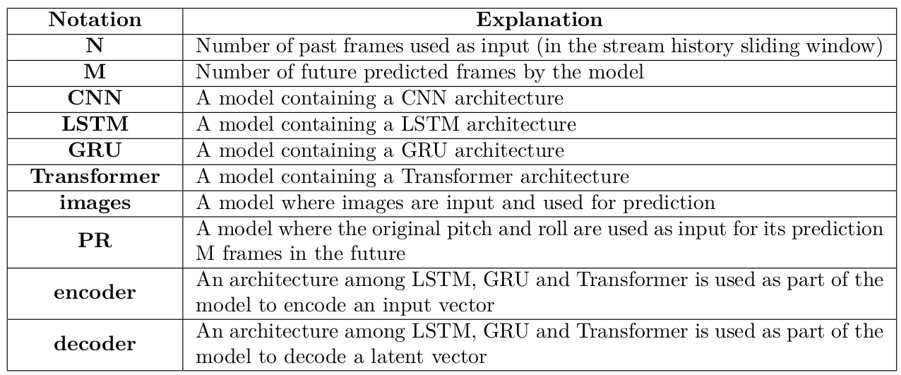
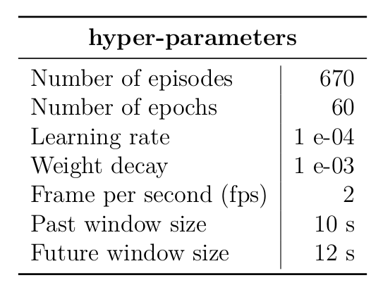

# Model Creation

This work is based on the work of Nazar,  some information can be found here: [[link]](https://github.com/Nazotron1923/Deep_learning_models_for_ship_motion_prediction_from_images)

To solve our pitch and roll prediction problem, 16 mdoels based on the existent wors are created. GRU - Gated recurrent unit networks, Attention mechanism are used. The structure of the extent models are changed from sequence length of size 1 to sequence length of size N in order to make full use of Attention Mechanism. Transformer Model are also considered to be used. An overview of all the models above is given, and the proposed model created in this internship are also analyzed. 

<p align="center">
  
</p>
<p align="justify">

16 models were created:

***Models with sequecne length of size 1***
- GRU encoder deocder PR model
- GRU encoder deocder PR model
- CNN GRU encoder decoder images PR  model
- CNN GRU encoder attention decoder images PR  model
- CNN LSTM encoder GRU attention decoder images PR  model

***Models with sequecne length of size N***
- LSTM encoder decoder PR* model
- GRU encoder decoder PR* model
- LSTM encoder attention decoder PR* model
- LSTM encoder GRU attention decoder PR* model
- GRU encoder attention decoder PR* model
- CNN GRU encoder decoder PR* model
- CNN LSTM encoder attention decoder PR* model
- CNN LSTM encoder GRU attention decoder images PR* model
  
***Models without RNN***
- TransformerModel_PR model


<p align="center">
  
</p>
<p align="justify">


LSTM/GRU encoder deocder PR  | CNN LSTM/GRU encoder decoder images PR
:-------------------------:|:-------------------------:
  | 

LSTM/GRU encoder attention deocder PR  |  Attention deocder
:-------------------------:|:-------------------------:
  | 

Attention layer of size 1  | CNN LSTM/GRU encoder attention  decoder images PR
:-------------------------:|:-------------------------:
  | 


LSTM/GRU encoder deocder PR*  | CNN LSTM/GRU encoder decoder images PR*
:-------------------------:|:-------------------------:
  | 

LSTM/GRU deocder*   | CNN LSTM/GRU encoder attention  decoder images PR*
:-------------------------:|:-------------------------:
  | 

LSTM/GRU encoder attention deocder PR*  |  Attention deocder*
:-------------------------:|:-------------------------:
  | 


### Results

First, the basic settings were tested;

<p align="center">

</p>
<p align="justify">

The results of the experiments can be found in Table, which shows the normalized average MSE of the sum of pitch and roll over the predicted sequence (of 24 frames of length).

<p align="center">

</p>
<p align="justify">

Red line - our baseline LSTM encoder decoder PR model, the worst result; Light green line - the best result at the moment; Strong green line - second result.


<p align="center">

</p>
<p align="justify">

Testing results for all models. Denormalized MSE for pitch and roll at 10s in predicted sequences. Red line - our baseline and the worst result; Light green line - the best result at the moment; Strong green line - second result.


<p align="center">

</p>
<p align="justify">

<p align="center">

</p>
<p align="justify">

# The best configuration

Using Hyperband [algorithm](https://github.com/zygmuntz/hyperband) the best configuration for CNN_LSTM_encoder_decoder_images_PR model was found:

<p align="center">

</p>
<p align="justify">


LSTM encoder decoder pitch [baseline]  |  LSTM encoder decoder roll [baseline]
:-------------------------:|:-------------------------:
  | 


CNN LSTM encoder decoder images PR model pitch at 15 sec  |  CNN LSTM encoder decoder images PR model roll at 15 sec
:-------------------------:|:-------------------------:
  | 

CNN LSTM encoder decoder images PR model pitch at 30 sec |  CNN LSTM encoder decoder images PR model roll at 30 sec
:-------------------------:|:-------------------------:
  | 


### Conclusion

In this work, in order to predict ship motion from images, nine deep neural network models were created and tested. Such variety of models is caused by the complexity of the problem. Empirical results show that models with LSTM parts and using additional information such as the current ship motion improve the pitch and roll prediction accuracy. The best result was achieved by a [CNN LSTM encoder-decoder images PR] model. The best combination of parameters was found using Hyperband algorithm (learning rate, weight decay, encoder latent vector size and decoder latent vector size). In general, the model normally exhibits fluctuations, and sometimes skips large peaks (not being accurately enough for the angle value). The problem is still not completely solved and can have many improvements. Even in the best version of the created model there are problems such as overfitting, poor generalization, etc.
Still, not solved the problem with the data, to achieve a better result and good working model real data from the ship is needed.
However, reasonable predictions are achieved with the proposed model.

### License

This project is released under a [GPLv3 license](LICENSE).

### Dependencies

To run all scripts the presented environment is needed:

 - environment.yml


# Files explanations


`constants`: defines some main constants of the project

`models.py`: neural network models

`train.py`: used to train all models

`autoencoder_train.py`: used to train autoencoder model

`test.py`: used to predict all results

`utils.py`: some useful functions

`hyperband.py`: implementation of the Hyperband algorithm

`get_hyperparameters_configuration.py`: define Hyperband space

`earlyStopping.py`: implementation of the Early Stoping technique

`help_plot.py, help_plot_2.py, help_plot_3.py `:  scripts to display some useful charts

`plot_compare_predicted_and_original_PR.py`: script to plot original and predicted pitch and roll

`plot_evolution_PR_over_predicted_seq.py`: script to plot evolution of predicted pitch and roll over sequence


# Step guidance:

1. clone repository

2. create directory tree:

---> Modules

------> 3dmodel

------> results

3. download the images dataset [here](https://drive.google.com/drive/folders/1RF8_wFfcIM0GIklXflPYv-tK3uaEWSSZ?usp=sharing) if you have not yet and put the dataset under the directory **3dmodel**

4. for train, goto Modules's parent folder and run command:

```
python3 -m Pre.train --train_folder Pre/3dmodel/test_4_episode_ --num_epochs 50 --batchsize 24 --learning_rate 0.001 --opt "adam" --seed 42 --no_cuda True --model_type "LSTM_encoder_decoder_PR" --encoder_latent_vector 300 --decoder_latent_vector 300 --future_window_size 20 --past_window_size 20 --frame_interval 12 --weight_decay 0.001 --use_n_episodes 540 --change_fps False --test 0
```

 
5. for prediction, goto Pre's parent folder and run command:
```
python3 -m Pre.test -f Pre/3dmodel/test_4_episode_ --num_epochs 50 --batchsize 24 --learning_rate 0.001 --opt "adam" --seed 42 --no_cuda True --load_weight_file "Pre/results/train_CNN_LSTM_encoder_decoder_images_PR_using_20_s_to_predict_30_s_lr_0.0001937_2019-08-12 18_29_35/weight/CNN_LSTM_encoder_decoder_images_PR_predict_30_s_using_20_s_lr_0.0001937_tmp.pth" --model_type "LSTM_encoder_decoder_PR" --encoder_latent_vector 300 --decoder_latent_vector 300 --future_window_size 20 --past_window_size 20 --frame_interval 12 --weight_decay 0.001 --use_n_episodes 540 --change_fps False
```
options:
 - train_folder    (str): folder's prefix where dataset is stored (path + episodes) - [Pre/3dmodel/test_4_episode_ ]
 - num_epochs      (int): number of epochs - [50]
 - batchsize       (int): batchsize - [32]
 - opt             (str): optimizer type  - ['adam', 'sgd']
 - learning_rate   (float): learning_rate - [0.000000001 - 0.01]
 - seed            (int): number to fix random processes - [42]
 - cuda            (boolean): True if we can use GPU
 - load_weight     (boolean): True if we will load model
 - load_weight_date(str): date of the test (part of the path)
 - model_type      (str): model type  - ['CNN_stack_FC_first', 'CNN_stack_FC', 'CNN_LSTM_image_encoder_PR_encoder_decoder', 'CNN_PR_FC', 'CNN_LSTM_encoder_decoder_images', 'LSTM_encoder_decoder_PR', 'CNN_stack_PR_FC', 'CNN_LSTM_encoder_decoder_images_PR', 'CNN_LSTM_decoder_images_PR'] 
 - encoder_latent_vector (int): size of encoder latent vector - [0 - 10000]
 - decoder_latent_vector (int): size of decoder latent vector - [0 - 10000]
 - future_window_size    (int): number of seconds to predict - [0 - 30]
 - past_window_size      (int): number of seconds using like input - [0 - 30]
 - frame_interval        (int): interval at witch the data was generated - [12 if 2 fps]
 - weight_decay          (float): L2 penalty - [0.000000001 - 0.01]
 - use_n_episodes        (int): number of episodes use for work -  [0 - 540]
 - test_dir              (str): if you run a parameter test, all results will be stored in test folder
 - change_fps            (boolean): True if we want to use 1 fps when data was generated with 2 fps.
 - test                  (int): - [0 - train model ; 1 - hyperband test (hyperparameters search)]
 
# Some issues
1. Be careful when setting parameters, check constants: for example, the sequence time [LEN_SEQ] should be large enough to include past window size + future window size. To set it go to constants.py file!
